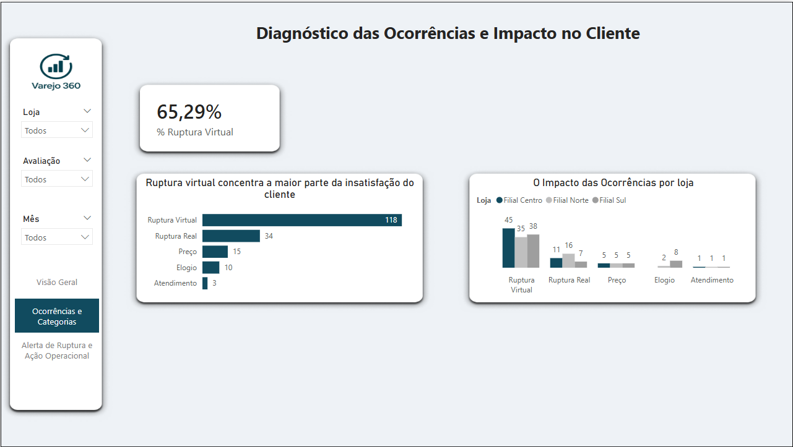
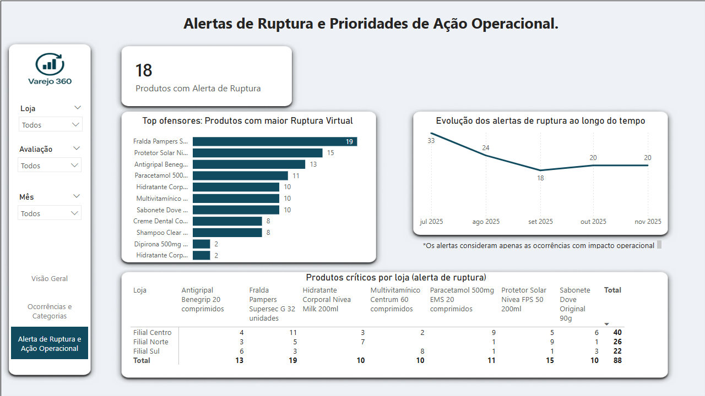

# Varejo 360 — Monitoramento Inteligente de Ocorrências no Varejo

## 1. Contexto do problema

No varejo físico, uma das maiores fontes de insatisfação do cliente não é necessariamente a falta de vendas, mas a experiência frustrada no ponto de venda. Produtos que constam como disponíveis no sistema, mas não estão na prateleira, divergências de preço e falhas operacionais impactam diretamente a percepção do consumidor e a eficiência da operação.

O desafio está em transformar reclamações e avaliações dispersas em informações estruturadas, capazes de apoiar decisões operacionais e priorização de ações no dia a dia das lojas.

Este projeto nasce com esse objetivo: organizar, analisar e visualizar ocorrências do varejo de forma clara, prática e orientada à ação.

---

## 2. Objetivo do projeto

O Varejo 360 tem como objetivo oferecer uma visão integrada das ocorrências registradas pelos clientes, com foco em:
* **Identificar padrões de insatisfação**.
* **Detectar rupturas virtuais e reais**.
* **Priorizar produtos e lojas críticas**.
* **Apoiar decisões operacionais com dados**.

Tudo isso com foco em clareza executiva, leitura rápida e aplicabilidade prática.

---

## 3. Visão geral da solução

A solução foi estruturada em três camadas principais:
* **Geração e tratamento de dados**.
* **Classificação inteligente das ocorrências**.
* **Visualização executiva no Power BI**.

O fluxo parte de dados simulados de varejo, passa por um pipeline em Python com apoio de IA generativa para classificação de ocorrências e termina em dashboards interativos que traduzem dados em decisões.
O Power BI atua como camada final de consolidação e tomada de decisão, conectando indicadores técnicos a uma leitura executiva orientada à ação.

---

## 4. Uso de IA Generativa no projeto

A IA Generativa foi utilizada de forma controlada e objetiva, com foco em apoiar a análise, não substituí-la.

Especificamente, a IA foi aplicada para:

* **Classificar automaticamente os comentários dos clientes**
* **Identificar o tipo de ocorrência (ruptura virtual, ruptura real, preço, atendimento ou elogio)**
* **Determinar o sentimento associado à avaliação**
* **Sinalizar alertas de ruptura virtual quando aplicável**

A IA não toma decisões no projeto, ela atua como um apoio analítico para estruturar informações não estruturadas. 
As classificações geradas pela IA foram tratadas como insumo analítico e não como verdade absoluta, sendo utilizadas para estruturar padrões e tendências, não para decisões automatizadas.

---

## 5. Pipeline de dados - visão técnica simplificada

O pipeline foi construído a partir de dados simulados, com o objetivo de reproduzir cenários realistas do varejo e permitir foco na análise, modelagem e visualização. O processo seguiu as seguintes etapas:

* **Geração de dados fictícios realistas de varejo**
* **Padronização e normalização de produtos**
* **Classificação das ocorrências via IA**
* **Cálculo de métricas e indicadores**
* **Armazenamento dos dados em banco PostgreSQL em nuvem (Neon)**
* **Consumo dos dados pelo Power BI**

Essa abordagem permite fácil reprocessamento, escalabilidade e replicação do modelo.

---

## 6. Arquitetura da solução

Tecnologias utilizadas no projeto:

* **Python (pandas, SQLAlchemy)**
* **OpenAI API (classificação de texto)**
* **PostgreSQL (Neon)**
* **Figma (design do layout do dashboard)**
* **Power BI**
* **GitHub (versionamento)**

O layout visual do dashboard foi desenhado previamente no Figma e depois implementado no Power BI, garantindo consistência visual e melhor experiência de leitura.

---

## 7. Tratamento de dados e métricas

Durante o desenvolvimento do projeto, foi realizada uma etapa dedicada à validação e tratamento dos dados, com foco em consistência semântica e confiabilidade dos indicadores.

A coluna de custo analítico foi importada a partir de um arquivo CSV em notação científica, representando valores unitários em dólar por análise. Durante a etapa de transformação no Power Query, foram realizados ajustes de tipagem e correção de escala, garantindo que os valores representassem corretamente o custo unitário em dólar por análise.

Após o tratamento do dado base, a conversão monetária para real foi aplicada no DAX, utilizando uma taxa de câmbio fixa, com o objetivo de simular impacto financeiro e manter a regra de negócio separada da ingestão dos dados.

Essa abordagem permitiu manter métricas auditáveis, evitar ajustes artificiais nos indicadores e garantir clareza na interpretação dos resultados.

---

## 8. Dashboard — Panorama Executivo

Esta página oferece uma visão macro da operação.

Os elementos abordados:

* **Total de ocorrências registradas**
* **Quantidade de ocorrências negativas**
* **Alertas de ruptura identificados**
* **Custo médio estimado por análise (USD convertido para BRL – simulação)**
* **Distribuição das ocorrências por categoria**
* **Comparativo de ocorrências negativas por loja**
* **Evolução temporal das ocorrências**

Objetivo é permitir que um gestor entenda rapidamente onde estão os principais pontos de atenção.

---

## 9. Dashboard — Diagnóstico das Ocorrências e Impacto no Cliente

Nesta etapa, o foco é entender o impacto das ocorrências na experiência do cliente.

As principais análises:

* **Percentual de ocorrências relacionadas à ruptura virtual**
* **Identificação do principal fator de insatisfação comparando entre ruptura virtual, ruptura real e outros fatores**
* **Distribuição das ocorrências por loja e categoria**

Insight-chave: a ruptura virtual concentra a maior parte da insatisfação do cliente, indicando falhas entre o estoque sistêmico e a operação de loja.

---

## 10. Dashboard — Alertas de Ruptura e Ação Operacional

Esta página é orientada à ação, tendo os como principais recursos:

* **Quantidade de Produtos com alerta de ruptura virtual**
* **Top ofensores (produtos mais críticos) com maior número de alertas de ruptura virtual**
* **Evolução dos alertas ao longo do tempo**
* **Matriz de produtos críticos por loja**

O objetivo é apoiar decisões práticas, como:

* **Reposição prioritária**
* **Revisão de processos logísticos**
* **Ajustes de abastecimento por loja**

---

## 11. Principais insights do projeto

* **A ruptura virtual representa mais de 60% das ocorrências negativas**
* **Determinados produtos concentram alertas recorrentes**
* **Existem diferenças claras entre lojas no perfil de ocorrência**
* **A análise temporal indica recorrência do problema, não eventos isolados**

Esses insights permitem sair da reação pontual e avançar para uma gestão preventiva.

---

## 12. Estrutura do repositório

src/
	- gerar_dados.py
	- pipeline_main.py
sql/
	- create_table_analise_varejo360.sql
	- ruptura_virtual.sql
	- sentimento_loja.sql
dashboard/
	- Varejo_360.pbip
assets/
	- imagens do dashboard
README.md
requirements.txt

---

## 13. Próximos passos e evoluções possíveis

* **Conectar dados reais de vendas e estoque**
* **Integrar indicadores financeiros e tributários**
* **Criar alertas automáticos**
* **Expandir o uso de IA para análise preditiva**

---

## 14. Autor

**Matheus Rodrigues Lopes**
* Graduado em Ciências Contábeis | Estudante de Análise e Desenvolvimento de Sistemas (ADS)*
* **LinkedIn: [ https://www.linkedin.com/in/matheuslopesr/]**
* **GitHub: [ https://github.com/mrlopes15]**
